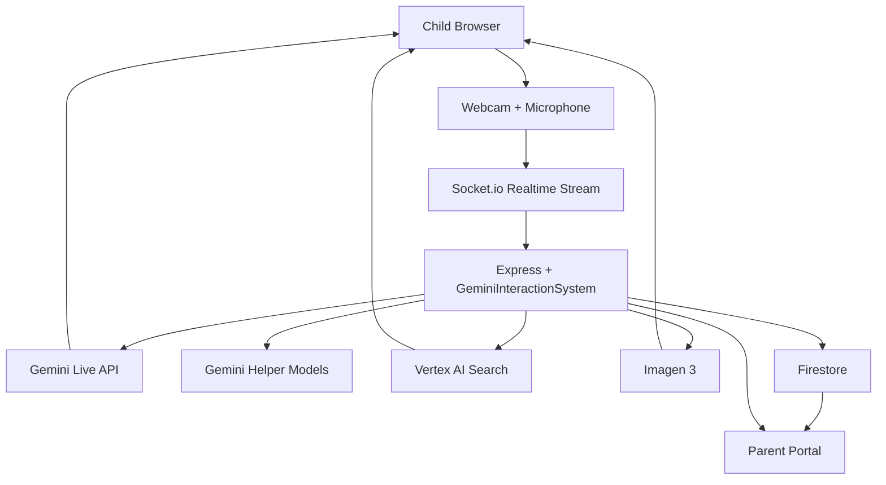

# Janus

### Real-time AI companion for children, built to turn curiosity into safe, guided exploration while keeping parents in the loop.

[Demo](#demo) • [The Problem](#the-problem) • [What Janus Does](#what-janus-does) • [Why It Wins](#why-janus-wins) • [Google Stack](#built-with-google) • [Safety & Security](#safety--security) • [How It Works](#how-it-works) • [Architecture](#architecture) • [Getting Started](#getting-started) • [Roadmap](#roadmap)

> Kids do not want to "search the internet." They want to point, ask, explore, move, and wonder.  
> Janus turns that energy into a live, safe, visual learning experience and gives parents visibility instead of guesswork.

## The Problem

Children are not interested in typing careful search queries into a box and reading blue links. Their curiosity is physical, fast, emotional, and constant. They want to hold up a flower, ask about a dinosaur, point at a machine, go on a scavenger hunt, and keep moving.

At the same time, one of the biggest real-world pressures on parents is keeping that curiosity alive while they handle everything else life demands. Parents want a tool that helps keep their child engaged, learning, and safe, without becoming an opaque black box.

There is a gap between:

- how children naturally explore the world
- how the internet expects them to ask questions
- how much visibility parents have into AI interactions

Janus is our answer to that gap.

## Demo

Built for the [Gemini Live API Challenge](https://geminiliveagentchallenge.devpost.com/).

Demo links can be dropped in here before submission:

- Live demo: `TODO`
- Demo video: `TODO`

## What Janus Does

Janus is a real-time multimodal AI companion for youth that sees through the camera, listens through the microphone, responds in natural voice, and brings learning into the child's physical space.

Instead of asking a child to sit still and type into a search bar, Janus lets them:

- ask questions out loud in natural language
- show real-world objects to the camera
- explore with AR-style teaching overlays
- go on short scavenger hunts
- see safe images and videos related to what they are curious about
- place generated creatures or objects onto visible surfaces like a table or desk
- interact with those generated objects through hand tracking

And Janus does not stop at the child experience. It exports the Gemini session into a parent-facing review flow so a parent can check what happened from their phone, see summaries, review alerts, and ask follow-up questions about the session.

## Why Janus Wins

### 1. It uses Gemini Live the way kids actually behave

Children do not interact with intelligence as text. They interact with intelligence as presence.

Janus uses live audio, live video, realtime transcription, visual grounding, and tool-driven interaction so the model can do more than answer. It can guide, react, point attention, celebrate, and stay quiet when the child is focused.

### 2. It transforms the internet into something a child can actually use

Janus is not "Google, but with a chatbot."

It changes the interaction model entirely:

- from typed search to spoken curiosity
- from abstract answers to grounded visuals
- from passive browsing to guided co-play
- from isolated sessions to parent-visible learning

### 3. It helps parents, not just children

This is not an AI toy that disappears into a black box.

Janus creates a parent layer with:

- exported Gemini session history
- conversation summaries
- activity logs
- distress and safety alerts
- at-risk event capture
- parent Q&A about what happened during the session

That makes Janus useful for the whole family, not just impressive for a demo.

### 4. It is ambitious in product design, not just model usage

We did not just connect a model and call it done. We built:

- a realtime child-facing companion
- a mobile-friendly parent portal
- an AR-style visual teaching system
- a retrieval stack for grounded visuals
- a clip-and-alert flow for parent awareness
- deployment infrastructure on Google Cloud

## Features

### Real-time multimodal conversation

- Live microphone streaming into Gemini
- Live camera streaming into Gemini
- Native voice responses in real time
- Realtime transcription for both the child and Janus
- Context-aware silence and wake behavior so Janus does not constantly interrupt

### Curiosity-driven visual learning

- `show_visual` tool for on-demand images and videos
- Real image retrieval first, AI generation second
- Child-safe prompts for image generation
- Clean visual rendering with graceful frontend fallbacks

### AR-style co-play

- Guided teaching overlays for objects the child is showing
- Short scavenger hunts that keep energy focused
- Celebration states for successful interaction
- Generated AR characters/objects placed onto visible surfaces
- Hand tracking so the child can grab and move those generated objects

### Parent intelligence layer

- Session history
- Session summaries
- Activity timelines
- Distress and safety indicators
- Parent-side Q&A assistant
- Mobile-aware portal for reviewing sessions on a phone

## Built With Google

Janus is deeply built around the Google AI and Google Cloud ecosystem.

### Gemini Live API

- Powers the core realtime child-facing experience
- Streams audio/video into a live model session
- Produces natural spoken responses
- Enables tool-calling during live interaction

### Gemini via the Google GenAI SDK

- Used for structured helper reasoning
- Used for parent-side assistant responses
- Used for summary generation
- Used for prompt-based scene/anchor reasoning
- Used for at-risk evaluation and contextual decisioning

### Imagen 3

- Generates child-safe visuals when grounded retrieval is not available
- Generates sprite-like AR characters and objects
- Generates photorealistic fallback images for curiosity-driven visual moments

### Vertex AI Search

- Retrieves real images for real-world concepts
- Lets Janus prefer grounded, factual, non-hallucinated visuals when possible
- Helps keep the experience educational instead of fully synthetic

### Firebase / Firestore

- Stores session transcripts
- Stores summaries, activities, co-play state, and alerts
- Creates the data backbone for the parent portal

### Google Cloud Run

- Hosts the backend service
- Runs with a dedicated runtime service account
- Uses default credentials in production instead of shipping secrets into runtime code

### Google Cloud Secret Manager

- Stores API secrets such as the YouTube key used for video retrieval
- Keeps sensitive values out of source code and deployment config

### Google Cloud IAM + Artifact Registry + Cloud Build

- IAM roles are granted for runtime and build responsibilities
- Artifact Registry stores container images
- Cloud Build builds the deployable container

## Safety & Security

Janus was designed for youth, which means safety and privacy could not be an afterthought.

### Child safety guardrails

- The core system prompt explicitly blocks violent, scary, adult, or age-inappropriate content
- Janus is instructed not to request or retain personal identifying information from children
- Emotional safety rules redirect the model toward comfort and a trusted grown-up instead of overstepping into counseling
- The visual generation prompts are constrained to bright, friendly, age-appropriate outputs

### Parent visibility by default

- Sessions are not hidden inside a model conversation
- Parents can review summaries, transcripts, activities, and alerts
- This creates accountability instead of blind trust

### Risk detection layers

- Transcript analysis looks for distress and safety signals
- Helper-model evaluation checks for at-risk behavior requiring adult attention
- At-risk events can include captured media context, not just text labels

### Cloud security posture

- Production runs on Cloud Run with runtime service accounts
- Firestore access is handled through Firebase Admin on trusted backend infrastructure
- Secrets are managed through Secret Manager
- Local development uses a service account file, while cloud runtime uses platform credentials

### Important note

Janus is a hackathon prototype with a strong safety-first architecture. It is not presented as a fully audited production child-safety platform. What it does show is the right direction: controlled prompts, parent visibility, backend-managed credentials, secret handling, and multiple layers of intervention logic.

## How It Works

### Child flow

1. A child opens Janus and activates the experience.
2. The browser starts the webcam and microphone.
3. Audio and video stream to the backend over Socket.io.
4. The backend opens a Gemini Live session and forwards realtime media input.
5. Gemini responds with live voice and can call tools to launch visuals, overlays, hunts, or generated AR objects.
6. Session activity is stored so parents can review it later.

### Parent flow

1. Session messages and activities are stored in Firestore.
2. The backend derives summaries, alerts, and at-risk events.
3. The parent portal fetches this session data.
4. A parent can review the session and ask Janus questions about what happened.

### Visual flow

1. Janus receives a child request like "show me a tiger" or "show me the Eiffel Tower."
2. The backend first searches for a real image using Vertex AI Search.
3. Search results are filtered and scored to remove junk results.
4. If no good real result survives, Imagen 3 generates a safe fallback image.
5. The child sees a visual answer without needing to browse the web.

## Architecture



### Core backend pieces

- `backend/src/server.ts`
  Serves the frontend, exposes parent APIs, and hosts the realtime socket server.

- `backend/src/scripts/gemini-interactions-system.ts`
  The main realtime engine. Handles Gemini Live sessions, tool calls, silence logic, transcript storage, summary generation, at-risk detection, generated AR objects, and activity persistence.

- `backend/src/scripts/media-search-service.ts`
  Handles image and video retrieval. This became a major quality-control layer after naive search returned junk results.

- `backend/src/scripts/parent-chat.ts`
  Shapes stored session data into something a parent can understand and query.

## Security-Focused Design Choices

These are not marketing bullets. They are reflected directly in the implementation:

- Child PII is explicitly discouraged in the system prompt
- Risky content is blocked at the prompt layer
- Distress and safety language is surfaced for parents
- Production credentials come from Cloud Run identity instead of hardcoded runtime secrets
- Secrets are provisioned into Secret Manager during deployment
- Firestore session storage keeps parent-facing review on the backend side
- The deployment script creates a dedicated runtime service account and grants only needed roles

## Why This Matters For Youth

The internet was not designed around the way young children learn.

Children learn by:

- asking out loud
- pointing at things
- moving around
- repeating themselves
- seeing vivid feedback
- staying engaged through play

Janus meets them there.

Instead of flattening curiosity into text entry, Janus gives children a guided, visual, voice-first path through exploration while giving parents confidence that the experience is visible, reviewable, and designed with safeguards.

This is not just a better interface. It is a different model for how youth interact with the internet.

## Getting Started

### Prerequisites

- Node.js
- npm
- A Google Cloud project
- Gemini / Vertex access
- Firestore configured
- `service-account.json` for local development
- Optional `YOUTUBE_API_KEY`

### Install

```bash
npm install
```

### Local development

```bash
npm run dev
```

This starts:

- Vite frontend
- TypeScript backend with nodemon

### Build

```bash
npm run build
```

### Production start

```bash
npm run start
```

## Deployment

Janus includes a deployment script that prepares a Google Cloud deployment path:

- enables required Google Cloud APIs
- creates or reuses a project
- ensures Firestore exists
- creates a Cloud Run runtime service account
- grants runtime IAM roles
- syncs the YouTube key into Secret Manager
- builds the container with Cloud Build
- deploys the service to Cloud Run

> A prerequisite is you need [gcloud cli](https://docs.cloud.google.com/sdk/docs/install-sdk) installed, with your account authenticated via `gcloud auth login`.

> Note: A billing account must be connected for deployment to succeed.

Run:

```bash
./deploy.sh
```

## Roadmap

- Persistent child-safe memory
- Better personalized learning loops
- Stronger parent controls and settings
- More precise risk detection and review workflows
- Better AR grounding and placement
- Richer mobile parent experience
- More structured lesson modes for specific age ranges

## Built For

Janus was built for the [Gemini Live API Challenge](https://geminiliveagentchallenge.devpost.com/).

We wanted to show what a live AI agent can look like when it is designed for the way children actually explore the world: energetic, visual, curious, and always moving, with parents included instead of excluded.
